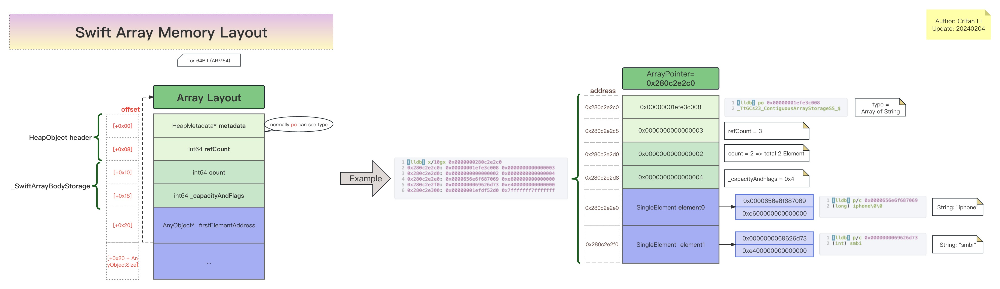
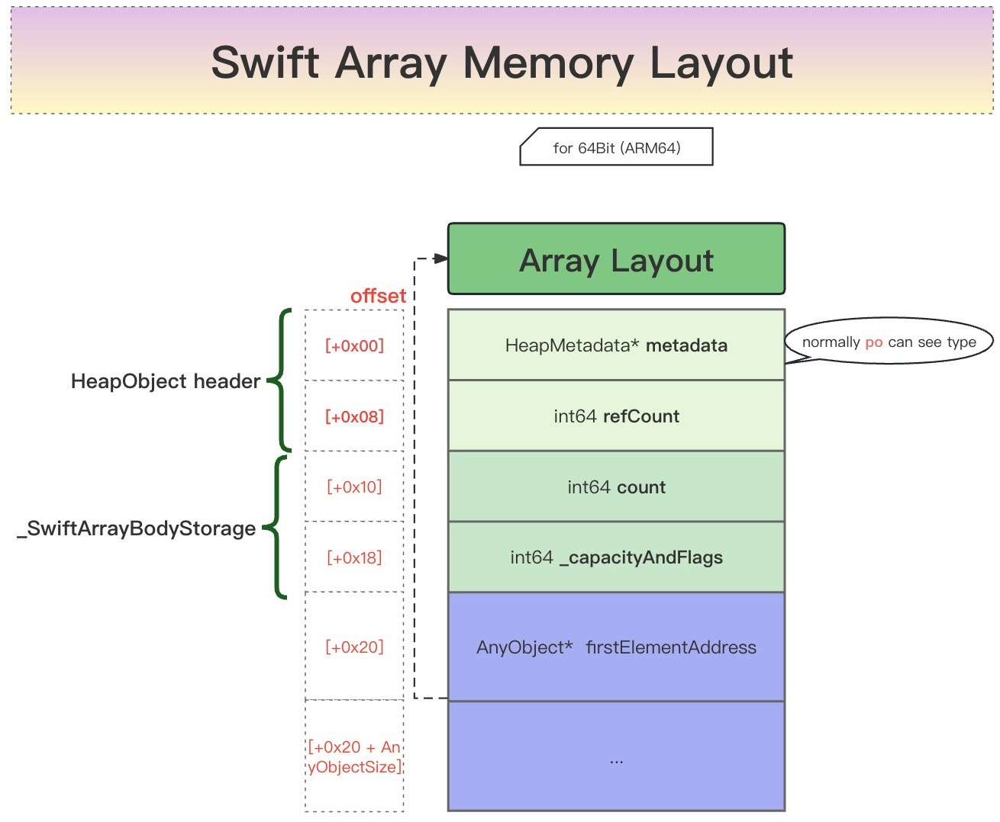

# Swift的Array的内存布局图

* Swift的Array的内存布局图 = Swift Array Memory Layout
  * 在线预览
    * [Swift的Array内存布局结构图| ProcessOn免费在线作图,在线流程图,在线思维导图](https://www.processon.com/view/link/65bfab18f5eb44119a7f62bb)
  * 离线查看
    * 
  * 核心内容
    * 
