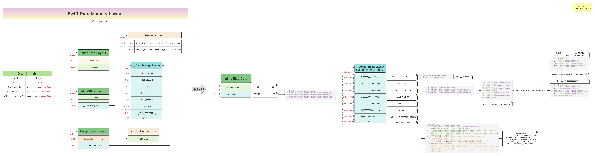
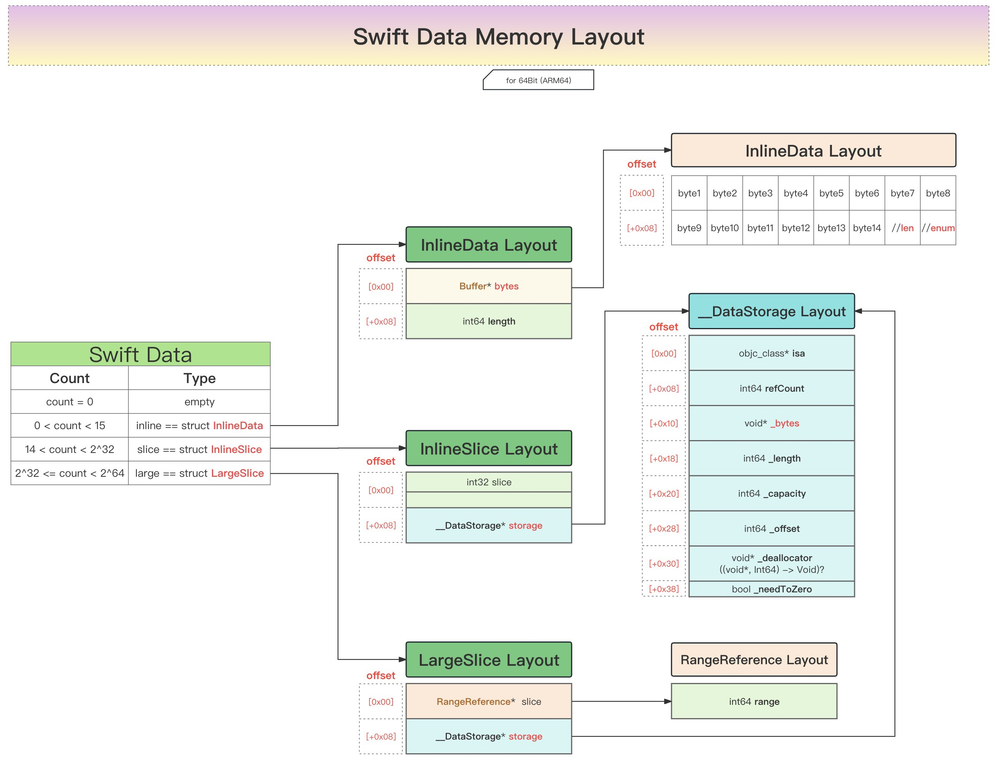

# Swift的Data数据的内存布局结构图

* Swift的Data数据的内存布局结构图  = Swift Data Memory Layout
  * 在线预览
    * [Swift的Data内存布局结构图| ProcessOn免费在线作图,在线流程图,在线思维导图](https://www.processon.com/view/link/65d0cd7c28bf1d00d08a3cbc)
  * 离线查看
    * 
  * 核心内容
    * 
