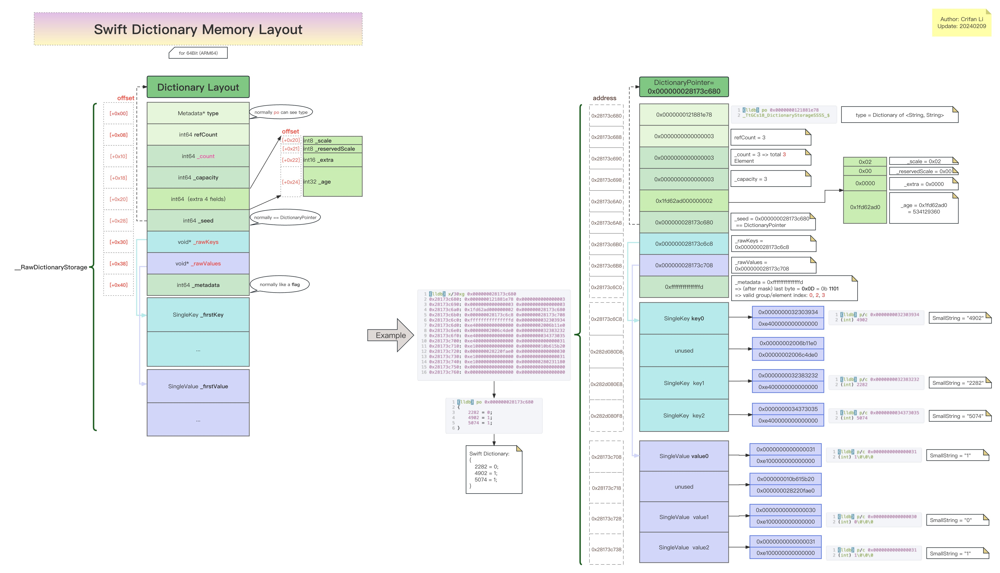
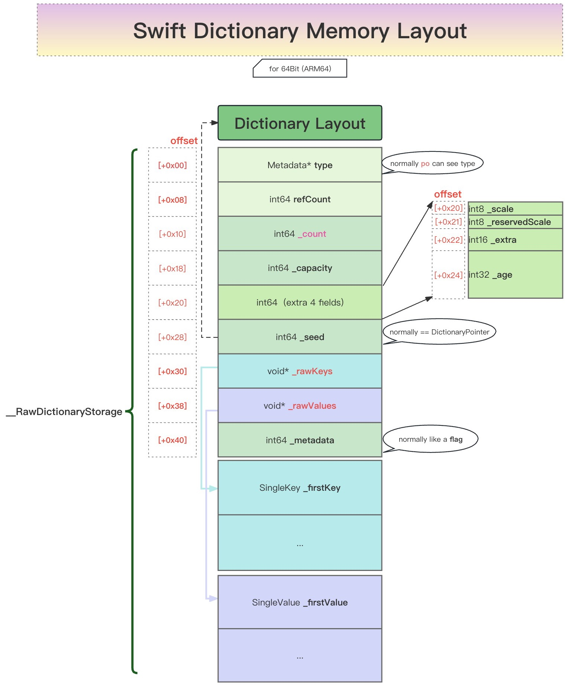

# Swift的Dictionary内存布局结构图

* Swift的Dictionary内存布局结构图
  * 在线浏览
    * [Swift的Dictionary内存布局结构图| ProcessOn免费在线作图,在线流程图,在线思维导图](https://www.processon.com/view/link/65c5cbb80f4b513151047d3e)
  * 本地查看
    * 完整图
      * 
    * 核心内容
      * 
