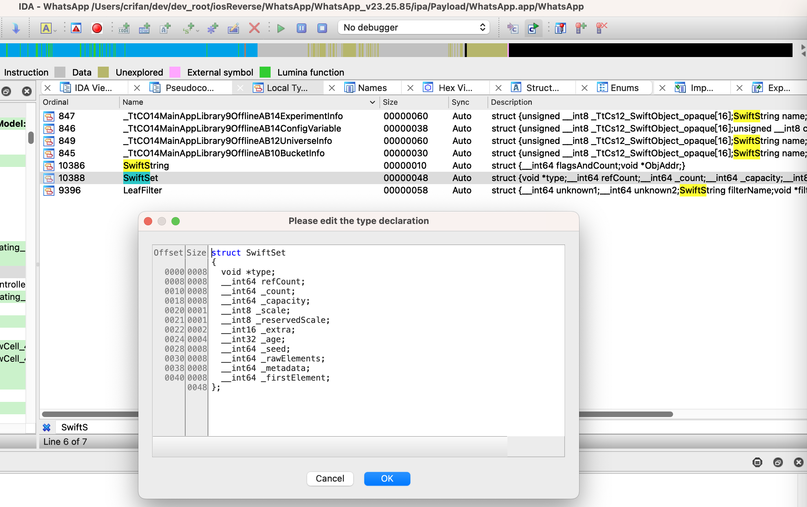

# IDA定义

```c
struct SwiftSet
{
  void *type;
  __int64 refCount;
  __int64 _count;
  __int64 _capacity;
  __int8 _scale;
  __int8 _reservedScale;
  __int16 _extra;
  __int32 _age;
  __int64 _seed;
  __int64 _rawElements;
  __int64 _metadata;
  __int64 _firstElement;
};
```


