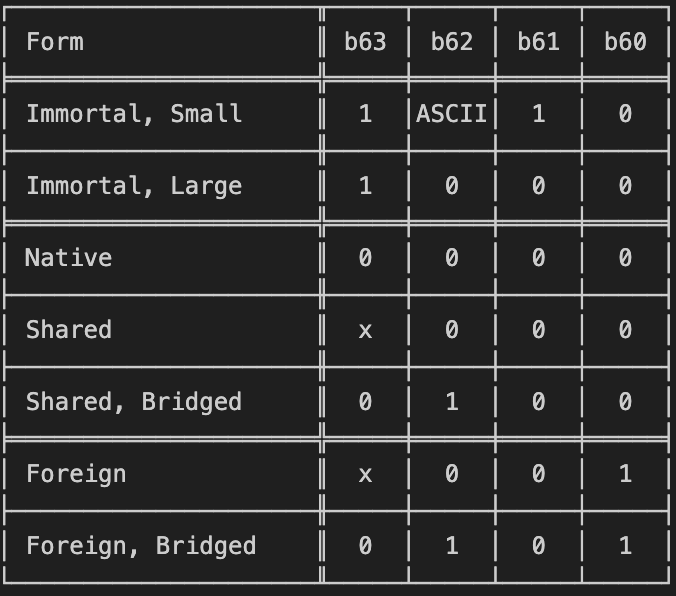

# 文字

## 概述

* Swift中Large String
  * Native
    * 真正字符串的地址=objectAddr+0x20
  * Shared/Foreign
    * 真正字符串的地址=objectAddr

## 详解

* Swift的String(64位)
  * 通用（Small String和Large String都有）
    * discriminator
      * 关于名称和
        * 位置
          * == leading nibble == top nibble = 64bit的最顶部的4个bit：b63:b60 == [bit63 ~ bit60]
            * 注：nibble=半个字节 = 4bit
        * 名称
          * （此处有个专门的名字）discriminator = 辨别器：用于区分字符串的具体类型
            * 其实叫做：String type 更加容易理解
        * 所以代码和注释中下面的名称是一个意思：
          * b63:b60 = discriminator = leading nibble == top nibble
      * 具体字段和含义
        * b63 = isImmortal
          * Should the Swift runtime skip ARC
            * Small strings are just values, always immortal
            * Large strings can sometimes be immortal, e.g. literals
        * b62 = (large) isBridged / (small) isASCII
          * For large strings, this means lazily-bridged NSString: perform ObjC ARC
          * Small strings repurpose this as a dedicated bit to remember ASCII-ness
        * b61 = isSmall
          * Dedicated bit to denote small strings
        * b60 = isForeign = isSlow
          * cannot provide access to contiguous UTF-8
      * 完整的映射表 = 不同字段的组合，表示不同类型字符串
        * 
  * Small String
    * [+0x00-0x0E] = 8+7个字节 =15个字节 = 64+56位 = 120位 : realString
    * [+0xF] = 第16个字节=共8位: discriminator + count
      * byte15的[b4:b7] = discriminator
      * byte15的[b0:b3] = count
  * Large String
    * [+0x00-0x07 ] = 8个字节 = 64位 : flag
      * b63 = ASCII = isASCII
      * b62 = NFC = isNFC
      * b61 = native = isNativelyStored
      * b60 = tail = isTailAllocated
      * b59 = UTF8 = isForeignUTF8
      * b58:48 = reserved
      * b47:0 = count
    * [+0x08-0x0F] = 8个字节 = 64位 : discriminator + objectAddr
      * b63:b60 = discriminator
        * 详见上述解释：b63 = isImmortal、b62 = (large) isBridged / (small) isASCII、b61 = isSmall、b60 = isForeign = isSlow
      * b60:b0 = objectAddr
        * realStrAddr = objectAddr + nativeBias = objectAddr + 32 = objectAddr + 0x20
