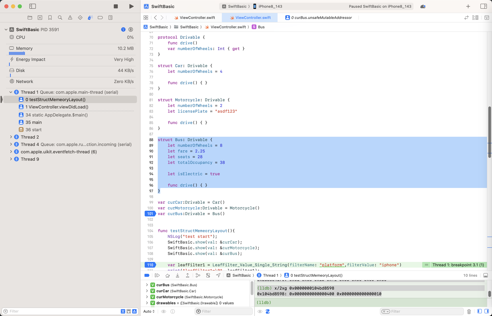
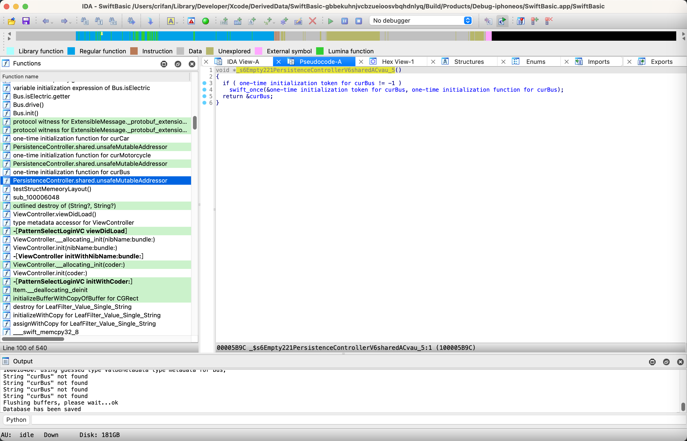
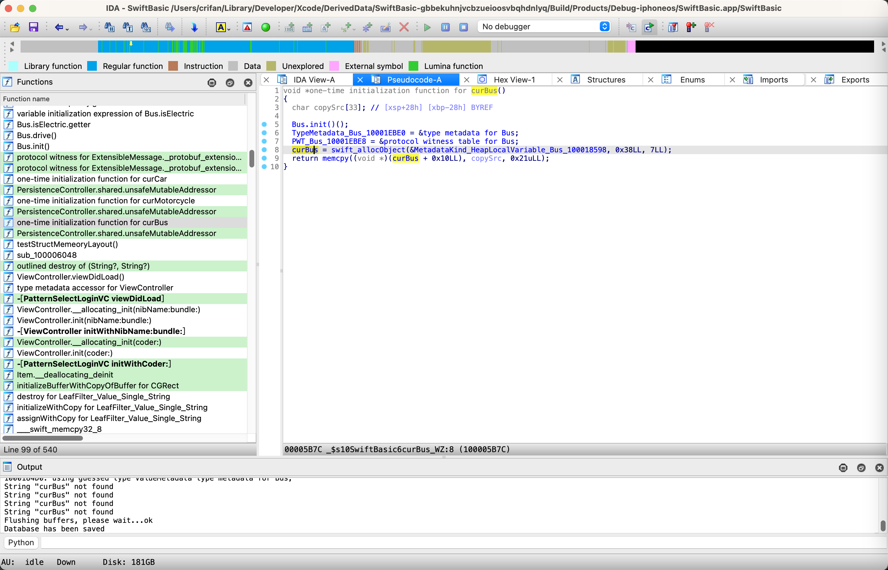

# 举例

## 纯Structure=不带Protocol的Structure

```swift
struct Person {
    let name = "Crifan Li"
    let height = 1.83
    let isMale = true
    let age = 20
}
var person = Person()
```

对应内存数据：

```bash
(lldb) x/8xg 0x0000000102f82bf0
0x102f82bf0: 0x4c206e6166697243 0xe900000000000069
0x102f82c00: 0x3ffd47ae147ae148 0x0000000000000001
0x102f82c10: 0x0000000000000014 0x0000000000000000
0x102f82c20: 0x0000000000000000 0x0000000000000000
(lldb) p/c 0x4c206e6166697243
(Int) Crifan L
(lldb) p/c 0x00000000000069
(Int) i\0\0\0\0\0\0\0
(lldb) p/f 0x3ffd47ae147ae148
(Int) 1.8300000000000001
(lldb) x/8xb 0x102f82c08
0x102f82c08: 0x01 0x00 0x00 0x00 0x00 0x00 0x00 0x00
(lldb) p/d 0x0000000000000014
(Int) 20
```

->

* Person结构体
  * 大小=40=0x28
  * 内存布局
    * Person实例= person = 0x0000000102f82bf0
      * [+0x00~0x08] = String name
        * 0x4c206e6166697243 0xe900000000000069
          * "Crifan Li"
      * [+0x10] = Float height
        * 0x3ffd47ae147ae148
          * Float值：1.83
      * [+0x18] = bool isMale
        * 0x01 = true
      * [+0x20] = Int age
        * 0x0000000000000014 = 20

## 带Protocol的Structure

### Struct结构体字段可以放得下`ValueBuffer[3]`的内存布局

代码：

```swift
protocol Drivable {
    func drive()
    var numberOfWheels: Int { get }
}

struct Car: Drivable {
    let numberOfWheels = 4
    let brand = "Tank300-Hi4T"

    func drive() { }
}

var curCar:Drivable = Car()
```

->

```bash
(lldb) x/8xg 0x000000010227aba0
0x10227aba0: 0x0000000000000004 0x2d3030336b6e6154
0x10227abb0: 0xec00000054346948 0x0000000102274450
0x10227abc0: 0x0000000102274188 0x0000000000000000
0x10227abd0: 0x0000000000000000 0x0000000000000000

(lldb) p/c 0x2d3030336b6e6154
(Int) Tank300-
(lldb) p/c 0x00000054346948
(Int) Hi4T\0\0\0\0
```

->

* Protocol的Structure，字段没超过ValueBuffer[3] = ValueBuffer[3]可以放得下Structure的字段 的内存布局：Car = 0x000000010227aba0
  * [+0x00] = ValueBuffer[0] = int64 numberOfWheels
    * 0x0000000000000004
  * [+0x08~0x10] = ValueBuffer[1:2] = String brand
    * 0x2d3030336b6e6154 0xec00000054346948
      * "Tank300-Hi4T"
  * [+0x18] = TypeMetadata * typeMetadata
    * 0x0000000102274450 = typeMetadata_struct_Car
      * type metadata for SwiftBasic.Car
  * [+0x20] = PWT * pwt
    * 0x0000000102274188 = PWT_Car
      * protocol witness table for SwiftBasic.Car : SwiftBasic.Drivable in SwiftBasic

其中：

* 0x0000000102274450 = typeMetadata_struct_Car

```bash
(lldb) im loo -va 0x0000000102274450
  Address: SwiftBasic[0x0000000100018450] (SwiftBasic.__DATA_CONST.__const + 808)
  Summary: SwiftBasic`type metadata for SwiftBasic.Car
    Module: file = "/Users/crifan/Library/Developer/Xcode/DerivedData/SwiftBasic-gbbekuhnjvcbzueioosvbqhdnlyq/Build/Products/Debug-iphoneos/SwiftBasic.app/SwiftBasic", arch = "arm64"
    Symbol: id = {0x000004be}, range = [0x0000000102274450-0x0000000102274468), name="type metadata for SwiftBasic.Car", mangled="$s10SwiftBasic3CarVN"
```

* 0x0000000102274188 = PWT_Car

```bash
(lldb) im loo -va 0x0000000102274188
  Address: SwiftBasic[0x0000000100018188] (SwiftBasic.__DATA_CONST.__const + 96)
  Summary: SwiftBasic`protocol witness table for SwiftBasic.Car : SwiftBasic.Drivable in SwiftBasic
    Module: file = "/Users/crifan/Library/Developer/Xcode/DerivedData/SwiftBasic-gbbekuhnjvcbzueioosvbqhdnlyq/Build/Products/Debug-iphoneos/SwiftBasic.app/SwiftBasic", arch = "arm64"
    Symbol: id = {0x000004ac}, range = [0x0000000102274188-0x00000001022741a0), name="protocol witness table for SwiftBasic.Car : SwiftBasic.Drivable in SwiftBasic", mangled="$s10SwiftBasic3CarVAA8DrivableAAWP"
```

### Structue字段超过`ValueBuffer[3]`的Struct结构体的内存布局

代码：

```swift
protocol Drivable {
    func drive()
    var numberOfWheels: Int { get }
}

struct Bus: Drivable {
    let numberOfWheels = 8
    let fare = 2.25
    let seats = 28
    let totalOccupancy = 38

    let isElectric = true

    func drive() { }
}

var curBus:Drivable = Bus()
```



对应的生成的相关初始化代码是：

```c
void *_s6Empty221PersistenceControllerV6sharedACvau_5()
{
  if ( one-time initialization token for curBus != -1 )
    swift_once(&one-time initialization token for curBus, one-time initialization function for curBus);
  return &curBus;
}
```



和：

```c
void *one-time initialization function for curBus()
{
  char copySrc[33]; // [xsp+28h] [xbp-28h] BYREF

  Bus.init()();
  TypeMetadata_Bus_10001EBE0 = &type metadata for Bus;
  PWT_Bus_10001EBE8 = &protocol witness table for Bus;
  curBus = swift_allocObject(&MetadataKind_HeapLocalVariable_Bus_100018598, 0x38LL, 7LL);
  return memcpy((void *)(curBus + 0x10LL), copySrc, 0x21uLL);
}
```



-》相关调试数据：

```bash
-------------- Drivable --------------
变量的地址: 0x0000000104bdebc8
变量的内存: 0x0000000283354140 0x0000000000000000 0x0000000000000000 0x0000000104bd84d0 0x0000000104bd81a0
变量的大小: 40=0x28

(lldb) x/6xg 0x0000000104bdebc8
0x104bdebc8: 0x0000000283354140 0x0000000000000000
0x104bdebd8: 0x0000000000000000 0x0000000104bd84d0
0x104bdebe8: 0x0000000104bd81a0 0x0000000000000000
(lldb) x/8xg 0x0000000283354140
0x283354140: 0x0000000104bd8598 0x0000000000000003
0x283354150: 0x0000000000000008 0x4002000000000000
0x283354160: 0x000000000000001c 0x0000000000000026
0x283354170: 0x00000003f11bc601 0x00000001f9b262ce
(lldb) im loo -va 0x0000000104bd84d0
      Address: SwiftBasic[0x00000001000184d0] (SwiftBasic.__DATA_CONST.__const + 936)
      Summary: SwiftBasic`type metadata for SwiftBasic.Bus
       Module: file = "/Users/crifan/Library/Developer/Xcode/DerivedData/SwiftBasic-gbbekuhnjvcbzueioosvbqhdnlyq/Build/Products/Debug-iphoneos/SwiftBasic.app/SwiftBasic", arch = "arm64"
       Symbol: id = {0x000004c1}, range = [0x0000000104bd84d0-0x0000000104bd84f8), name="type metadata for SwiftBasic.Bus", mangled="$s10SwiftBasic3BusVN"
(lldb) im loo -va 0x0000000104bd81a0
      Address: SwiftBasic[0x00000001000181a0] (SwiftBasic.__DATA_CONST.__const + 120)
      Summary: SwiftBasic`protocol witness table for SwiftBasic.Bus : SwiftBasic.Drivable in SwiftBasic
       Module: file = "/Users/crifan/Library/Developer/Xcode/DerivedData/SwiftBasic-gbbekuhnjvcbzueioosvbqhdnlyq/Build/Products/Debug-iphoneos/SwiftBasic.app/SwiftBasic", arch = "arm64"
       Symbol: id = {0x000004ad}, range = [0x0000000104bd81a0-0x0000000104bd81b8), name="protocol witness table for SwiftBasic.Bus : SwiftBasic.Drivable in SwiftBasic", mangled="$s10SwiftBasic3BusVAA8DrivableAAWP"
(lldb) p/f 0x4002000000000000
(Int) 2.25
(lldb) p/d 0x000000000000001c
(Int) 28
(lldb) p/d 0x0000000000000026
(Int) 38
(lldb) x/8xb 0x283354170
0x283354170: 0x01 0xc6 0x1b 0xf1 0x03 0x00 0x00 0x00
(lldb) x/2xg 0x0000000104bd8598
0x104bd8598: 0x0000000000000400 0x0000000000000010
```

->含义：

* Protocol的Structure的，且Structure字段超过ValueBuffer[3]的（Bus的）内存布局 = 
  * [+0x00] = ValueBuffer[0] = Structure的指针
    * 0x0000000283354140 = curBus的ptr
      * [+0x00] = MetadataKind kind
        * = 0x0000000000000400 == HeapLocalVariable
          * Bus是HeapLocalVariable类型变量
            * 内存是在堆中分配的
            * 且是个本地临时变量
      * [+0x08] = int64 refCount
        * 0x0000000000000003
      * Structure自己的属性值
        * [+0x10] = int64 numberOfWheels
          * 0x0000000000000008
        * [+0x18] = float fare
          * 0x4002000000000000 == 2.25
        * [+0x20] = int64 seats
          * 0x000000000000001c == 28
        * [+0x28] = int64 totalOccupancy
          * 0x0000000000000026 == 38
        * [+0x30] = bool(int8) isElectric
          * 0x01
  * [+0x08] = ValueBuffer[1] = 空 = 没用
  * [+0x10] = ValueBuffer[2] = 空 = 没用
  * [+0x18] = TypeMetadata * typeMetadata
    * 0x0000000104bd84d0 = typeMetadata_struct_Bus
      * type metadata for SwiftBasic.Bus
  * [+0x20] = PWT * pwt
    * 0x0000000104bd81a0 = PWT_Bus
      * protocol witness table for SwiftBasic.Bus : SwiftBasic.Drivable in SwiftBasic

其中：

* 0x0000000104bd84d0 = typeMetadata_struct_Bus

```bash
(lldb) im loo -va 0x0000000104bd84d0
  Address: SwiftBasic[0x00000001000184d0] (SwiftBasic.__DATA_CONST.__const + 936)
  Summary: SwiftBasic`type metadata for SwiftBasic.Bus
    Module: file = "/Users/crifan/Library/Developer/Xcode/DerivedData/SwiftBasic-gbbekuhnjvcbzueioosvbqhdnlyq/Build/Products/Debug-iphoneos/SwiftBasic.app/SwiftBasic", arch = "arm64"
    Symbol: id = {0x000004c1}, range = [0x0000000104bd84d0-0x0000000104bd84f8), name="type metadata for SwiftBasic.Bus", mangled="$s10SwiftBasic3BusVN"
```

* 0x0000000104bd81a0 = PWT_Bus

```bash
(lldb) im loo -va 0x0000000104bd81a0
  Address: SwiftBasic[0x00000001000181a0] (SwiftBasic.__DATA_CONST.__const + 120)
  Summary: SwiftBasic`protocol witness table for SwiftBasic.Bus : SwiftBasic.Drivable in SwiftBasic
    Module: file = "/Users/crifan/Library/Developer/Xcode/DerivedData/SwiftBasic-gbbekuhnjvcbzueioosvbqhdnlyq/Build/Products/Debug-iphoneos/SwiftBasic.app/SwiftBasic", arch = "arm64"
    Symbol: id = {0x000004ad}, range = [0x0000000104bd81a0-0x0000000104bd81b8), name="protocol witness table for SwiftBasic.Bus : SwiftBasic.Drivable in SwiftBasic", mangled="$s10SwiftBasic3BusVAA8DrivableAAWP"
```
