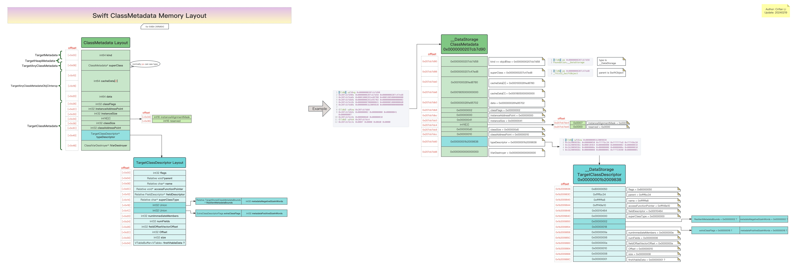
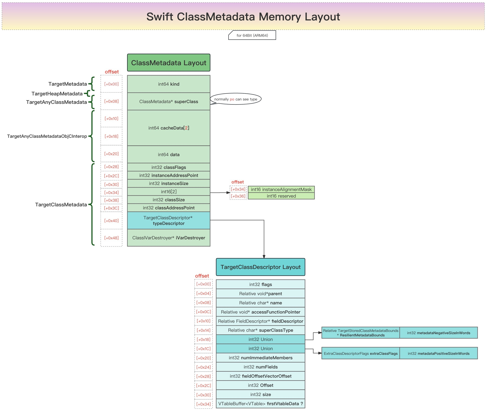

# Swift的ClassMetadata的内存布局结构图

* Swift的ClassMetadata的内存布局结构图  = Swift ClassMetadata Memory Layout
  * 在线预览
    * [Swift的ClassMetadata内存布局结构图| ProcessOn免费在线作图,在线流程图,在线思维导图](https://www.processon.com/view/link/65d362557a29576026eb6a64)
  * 离线查看
    * 
  * 核心定义
    * 
