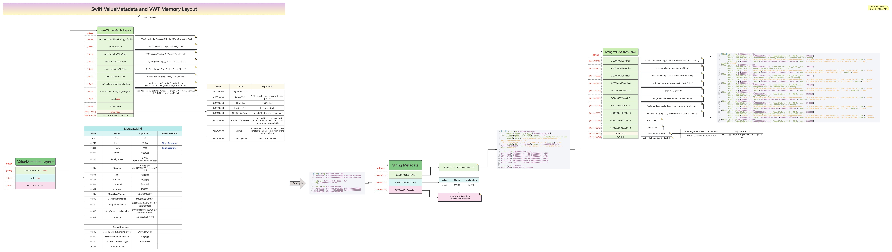
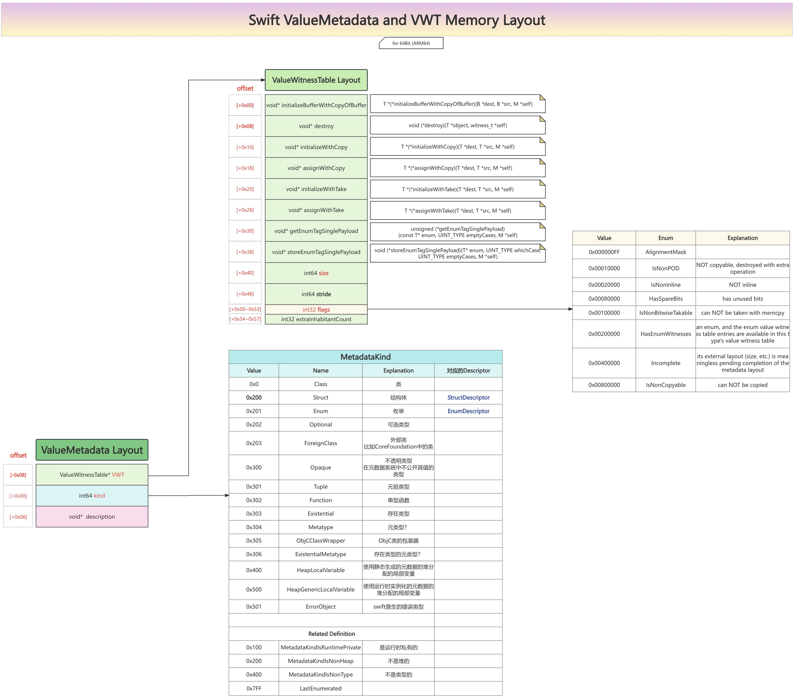

# ValueMetadata

## 内存布局

### 图

* Swift的ValueMetadata和VWT的内存布局结构图  = Swift ValueMetadata and VWT Memory Layout
  * 在线预览
    * [Swift的ValueMetadata和VWT的内存布局结构图| ProcessOn免费在线作图,在线流程图,在线思维导图](https://www.processon.com/view/link/65c2f8363c64b133055f83d4)
  * 离线查看
    * 
  * 核心定义
    * 

### 文字

* Swift中的：TargetValueMetadata
  * 继承关系
    * TargetValueMetadata = ValueMetadata
      * TargetMetadata
  * 字段=属性=内存布局
    * TargetMetadata
      * StoredPointer Kind
        * the kind. Only valid for non-class metadata; getKind() must be used to get the kind value
    * TargetValueMetadata
      * TargetSignedPointer* Description
        * An out-of-line description of the type
        * 说明
          * 此处的Description根据具体类型不同，则是不同的内容
        * 举例
          * Struct
            * TargetStructDescriptor=StructDescriptor

### 加到IDA中的定义

```c
struct ValueMetadata
{
  __int64 kind;
  void *description;
};
```
