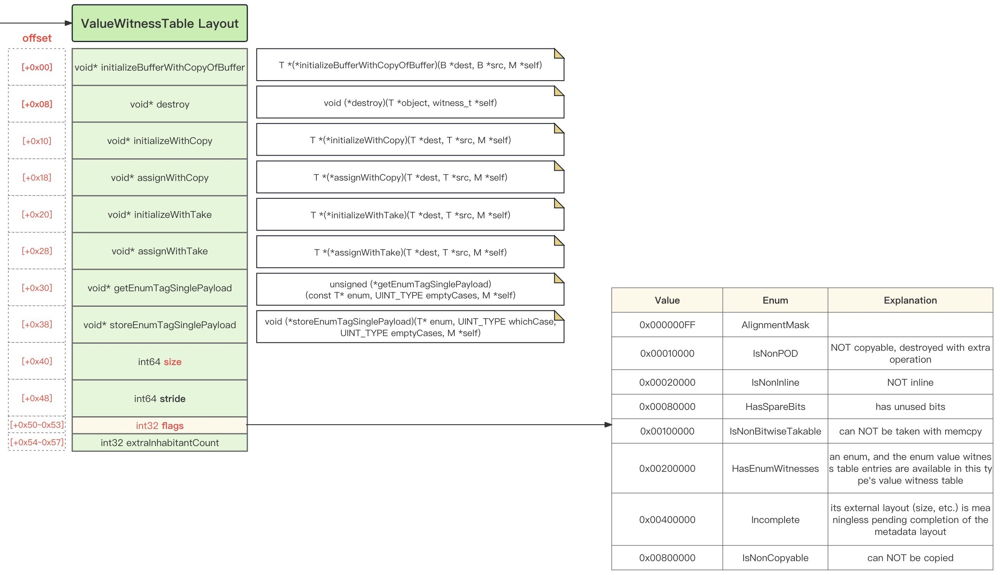

# `VWT`=`ValueWitnessTable`

## 概述


### VWT结构布局

#### 文字

* `Swift`的`VWT`=`Value Witness Table` 结构布局=字段=属性
  * [+0x00] = void* `initializeBufferWithCopyOfBuffer`
  * [+0x08] = void* `destroy`
  * [+0x10] = void* `initializeWithCopy`
  * [+0x18] = void* `assignWithCopy`
  * [+0x20] = void* `initializeWithTake`
  * [+0x28] = void* `assignWithTake`
  * [+0x30] = void* `getEnumTagSinglePayload`
  * [+0x38] = void* `storeEnumTagSinglePayload`
  * [+0x40] = void* int64 `size`
  * [+0x48] = void* int64 `stride`
  * [+0x50~0x53] = int32 `flags`
  * [+0x54~0x57] = int32 `extraInhabitantCount`

#### 图

* 概述
  * 
* 详见
  * [ValueMetadata](../valuemetadata/README.md)

### 加入到IDA中的定义

* struct `ValueWitnessTable`

```c
struct __cppobj ValueWitnessTable
{
  void (__fastcall *initializeBufferWithCopyOfBuffer)(void *dst, void *src, void *metadataSelf);
  void (__fastcall *destroy)(void *object, void *witnessSelf);
  void (__fastcall *initializeWithCopy)(void *dst, void *src, void *metadataSelf);
  void (__fastcall *assignWithCopy)(void *dst, void *src, void *metadataSelf);
  void (__fastcall *initializeWithTake)(void *dst, void *src, void *metadataSelf);
  void (__fastcall *assignWithTake)(void *dst, void *src, void *metadataSelf);
  unsigned __int64 (__fastcall *getEnumTagSinglePayload)(void *enumPtr, __int64 emptyCases, void *metadataSelf);
  void (__fastcall *storeEnumTagSinglePayload)(void *enumPtr, __int64 whichCase, void *metadataSelf);
  __int64 size;
  __int64 stride;
  TargetValueWitnessFlags flags;
  __int32 extraInhabitantCount;
};
```

* enum `TargetValueWitnessFlags`

```c
enum TargetValueWitnessFlags : __int32
{
  AlignmentMask = 0xFF,
  IsNonPOD = 0x10000,
  IsNonInline = 0x20000,
  HasSpareBits = 0x80000,
  IsNonBitwiseTakable = 0x100000,
  HasEnumWitnesses = 0x200000,
  Incomplete = 0x400000,
  IsNonCopyable = 0x800000,
};
```

## 详解

### 内存布局

* `Swift`的`VWT`=`Value Witness Table` 结构布局=字段=属性
  * [+0x00] = initializeBufferWithCopyOfBuffer
    * 定义：`T *(*initializeBufferWithCopyOfBuffer)(B *dest, B *src, M *self);`
  * [+0x08] = destroy
    * 定义：`void (*destroy)(T *object, witness_t *self);`
  * [+0x10] = initializeWithCopy
    * 定义：`T *(*initializeWithCopy)(T *dest, T *src, M *self);`
  * [+0x18] = assignWithCopy
    * 定义：`T *(*assignWithCopy)(T *dest, T *src, M *self);`
  * [+0x20] = initializeWithTake
    * 定义：`T *(*initializeWithTake)(T *dest, T *src, M *self);`
  * [+0x28] = assignWithTake
    * 定义：`T *(*assignWithTake)(T *dest, T *src, M *self);`
  * [+0x30] = getEnumTagSinglePayload
    * 定义：`unsigned (*getEnumTagSinglePayload)(const T* enum, UINT_TYPE emptyCases, M *self);`
  * [+0x38] = storeEnumTagSinglePayload
    * 定义：`void (*storeEnumTagSinglePayload)(T* enum, UINT_TYPE whichCase, UINT_TYPE emptyCases, M *self);`
  * [+0x40] = size
    * 定义：`SIZE_TYPE size;`
  * [+0x48] = stride
    * 定义：`SIZE_TYPE stride;`
  * [+0x50~0x53] = flags
    * 定义：`UINT_TYPE flags;`
  * [+0x54~0x57] = extraInhabitantCount
    * 定义：`UINT_TYPE extraInhabitantCount;`
* 说明
  * `SIZE_TYPE` = `StoredSize` = `size_t` ? = `int64`
  * `UINT_TYPE` = `unsigned` = `int32`


### Swfit代码

[swift-language/include/swift/ABI/ValueWitness.def at master · eaplatanios/swift-language](https://github.com/eaplatanios/swift-language/blob/master/include/swift/ABI/ValueWitness.def)

```c
///   T *(*initializeBufferWithCopyOfBuffer)(B *dest, B *src, M *self);
/// Given an invalid buffer, initialize it as a copy of the
/// object in the source buffer.
FUNCTION_VALUE_WITNESS(initializeBufferWithCopyOfBuffer,
                       InitializeBufferWithCopyOfBuffer,
                       MUTABLE_VALUE_TYPE,
                       (MUTABLE_BUFFER_TYPE, MUTABLE_BUFFER_TYPE, TYPE_TYPE))

BEGIN_VALUE_WITNESS_RANGE(ValueWitness,
                          InitializeBufferWithCopyOfBuffer)
BEGIN_VALUE_WITNESS_RANGE(RequiredValueWitness,
                          InitializeBufferWithCopyOfBuffer)
BEGIN_VALUE_WITNESS_RANGE(RequiredValueWitnessFunction,
                          InitializeBufferWithCopyOfBuffer)

///   void (*destroy)(T *object, witness_t *self);
///
/// Given a valid object of this type, destroy it, leaving it as an
/// invalid object.  This is useful when generically destroying
/// an object which has been allocated in-line, such as an array,
/// struct, or tuple element.
FUNCTION_VALUE_WITNESS(destroy,
                       Destroy,
                       VOID_TYPE,
                       (MUTABLE_VALUE_TYPE, TYPE_TYPE))

///   T *(*initializeWithCopy)(T *dest, T *src, M *self);
///
/// Given an invalid object of this type, initialize it as a copy of
/// the source object.  Returns the dest object.
FUNCTION_VALUE_WITNESS(initializeWithCopy,
                       InitializeWithCopy,
                       MUTABLE_VALUE_TYPE,
                       (MUTABLE_VALUE_TYPE, MUTABLE_VALUE_TYPE, TYPE_TYPE))

///   T *(*assignWithCopy)(T *dest, T *src, M *self);
///
/// Given a valid object of this type, change it to be a copy of the
/// source object.  Returns the dest object.
FUNCTION_VALUE_WITNESS(assignWithCopy,
                       AssignWithCopy,
                       MUTABLE_VALUE_TYPE,
                       (MUTABLE_VALUE_TYPE, MUTABLE_VALUE_TYPE, TYPE_TYPE))

///   T *(*initializeWithTake)(T *dest, T *src, M *self);
///
/// Given an invalid object of this type, initialize it by taking
/// the value of the source object.  The source object becomes
/// invalid.  Returns the dest object.
FUNCTION_VALUE_WITNESS(initializeWithTake,
                       InitializeWithTake,
                       MUTABLE_VALUE_TYPE,
                       (MUTABLE_VALUE_TYPE, MUTABLE_VALUE_TYPE, TYPE_TYPE))

///   T *(*assignWithTake)(T *dest, T *src, M *self);
///
/// Given a valid object of this type, change it to be a copy of the
/// source object.  The source object becomes invalid.  Returns the
/// dest object.
FUNCTION_VALUE_WITNESS(assignWithTake,
                       AssignWithTake,
                       MUTABLE_VALUE_TYPE,
                       (MUTABLE_VALUE_TYPE, MUTABLE_VALUE_TYPE, TYPE_TYPE))

/// unsigned (*getEnumTagSinglePayload)(const T* enum, UINT_TYPE emptyCases)
/// Given an instance of valid single payload enum with a payload of this
/// witness table's type (e.g Optional<ThisType>) , get the tag of the enum.
FUNCTION_VALUE_WITNESS(getEnumTagSinglePayload,
                       GetEnumTagSinglePayload,
                       UINT_TYPE,
                       (IMMUTABLE_VALUE_TYPE, UINT_TYPE, TYPE_TYPE))

/// void (*storeEnumTagSinglePayload)(T* enum, UINT_TYPE whichCase,
///                                   UINT_TYPE emptyCases)
/// Given uninitialized memory for an instance of a single payload enum with a
/// payload of this witness table's type (e.g Optional<ThisType>), store the
/// tag.
FUNCTION_VALUE_WITNESS(storeEnumTagSinglePayload,
                       StoreEnumTagSinglePayload,
                       VOID_TYPE,
                       (MUTABLE_VALUE_TYPE, UINT_TYPE, UINT_TYPE, TYPE_TYPE))

END_VALUE_WITNESS_RANGE(RequiredValueWitnessFunction,
                        StoreEnumTagSinglePayload)

///   SIZE_TYPE size;
///
/// The required storage size of a single object of this type.
DATA_VALUE_WITNESS(size,
                   Size,
                   SIZE_TYPE)

BEGIN_VALUE_WITNESS_RANGE(TypeLayoutWitness,
                          Size)

BEGIN_VALUE_WITNESS_RANGE(RequiredTypeLayoutWitness,
                          Size)

///   SIZE_TYPE stride;
///
/// The required size per element of an array of this type. It is at least
/// one, even for zero-sized types, like the empty tuple.
DATA_VALUE_WITNESS(stride,
                   Stride,
                   SIZE_TYPE)


///   UINT_TYPE flags;
///
/// The ValueWitnessAlignmentMask bits represent the required
/// alignment of the first byte of an object of this type, expressed
/// as a mask of the low bits that must not be set in the pointer.
/// This representation can be easily converted to the 'alignof'
/// result by merely adding 1, but it is more directly useful for
/// performing dynamic structure layouts, and it grants an
/// additional bit of precision in a compact field without needing
/// to switch to an exponent representation.
///
/// The ValueWitnessIsNonPOD bit is set if the type is not POD.
///
/// The ValueWitnessIsNonInline bit is set if the type cannot be
/// represented in a fixed-size buffer or if it is not bitwise takable.
///
/// The ExtraInhabitantsMask bits represent the number of "extra inhabitants"
/// of the bit representation of the value that do not form valid values of
/// the type.
///
/// The Enum_HasSpareBits bit is set if the type's binary representation
/// has unused bits.
///
/// The HasEnumWitnesses bit is set if the type is an enum type.
DATA_VALUE_WITNESS(flags,
                   Flags,
                   UINT_TYPE)

///   UINT_TYPE extraInhabitantCount;
///
/// The number of extra inhabitants in the type.
DATA_VALUE_WITNESS(extraInhabitantCount,
                   ExtraInhabitantCount,
                   UINT_TYPE)

END_VALUE_WITNESS_RANGE(RequiredTypeLayoutWitness,
                        ExtraInhabitantCount)

END_VALUE_WITNESS_RANGE(RequiredValueWitness,
                        ExtraInhabitantCount)

END_VALUE_WITNESS_RANGE(TypeLayoutWitness,
                        ExtraInhabitantCount)

#endif /* WANT_REQUIRED_VALUE_WITNESSES */

#if WANT_ENUM_VALUE_WITNESSES

// The following value witnesses are conditionally present if the witnessed
// type is an enum.

///   unsigned (*getEnumTag)(T *obj, M *self);
///
/// Given a valid object of this enum type, extracts the tag value indicating
/// which case of the enum is inhabited. Returned values are in the range
/// [0..NumElements-1].
FUNCTION_VALUE_WITNESS(getEnumTag,
                       GetEnumTag,
                       INT_TYPE,
                       (IMMUTABLE_VALUE_TYPE, TYPE_TYPE))

BEGIN_VALUE_WITNESS_RANGE(EnumValueWitness,
                          GetEnumTag)

///   void (*destructiveProjectEnumData)(T *obj, M *self);
/// Given a valid object of this enum type, destructively extracts the
/// associated payload.
FUNCTION_VALUE_WITNESS(destructiveProjectEnumData,
                       DestructiveProjectEnumData,
                       VOID_TYPE,
                       (MUTABLE_VALUE_TYPE, TYPE_TYPE))

///   void (*destructiveInjectEnumTag)(T *obj, unsigned tag, M *self);
/// Given an enum case tag and a valid object of case's payload type,
/// destructively inserts the tag into the payload. The given tag value
/// must be in the range [-ElementsWithPayload..ElementsWithNoPayload-1].
FUNCTION_VALUE_WITNESS(destructiveInjectEnumTag,
                       DestructiveInjectEnumTag,
                       VOID_TYPE,
                       (MUTABLE_VALUE_TYPE, UINT_TYPE, TYPE_TYPE))

END_VALUE_WITNESS_RANGE(EnumValueWitness,
                        DestructiveInjectEnumTag)

END_VALUE_WITNESS_RANGE(ValueWitness,
                        DestructiveInjectEnumTag)
```

### Swift的VWT和C++对应关系

| Swift Value Witness Operation | C++ equivalent |
| ------------------------------ | ----- |
| `initializeWithCopy` | copy constructor |
| `assignWithCopy` | copy assignment operator |
| `initializeWithTake` | move constructor, followed by a call to destructor on the source |
| `assignWithTake` | move assignment operator, followed by a call to destructor on the source |
| `destroy` | destructor |
| `size` | `sizeof(T)` minus trailing padding |
| `stride` | `sizeof(T)` |
| `flags` | among other information, contains alignment, i.e., `alignof(T)` |


### 举例

#### Builtin.NativeObject的VWT

* Builtin.NativeObject的VWT内存布局
  * [+0x00] = initializeBufferWithCopyOfBuffer
    * `name="swift::metadataimpl::BufferValueWitnesses<swift::metadataimpl::ValueWitnesses<swift::metadataimpl::SwiftRetainableBox>, true, 8ul, 8ul, (swift::metadataimpl::FixedPacking)1>::initializeBufferWithCopyOfBuffer(swift::TargetValueBuffer<swift::InProcess>*, swift::TargetValueBuffer<swift::InProcess>*, swift::TargetMetadata<swift::InProcess> const*)"`
      * `mangled="_ZN5swift12metadataimpl20BufferValueWitnessesINS0_14ValueWitnessesINS0_18SwiftRetainableBoxEEELb1ELm8ELm8ELNS0_12FixedPackingE1EE32initializeBufferWithCopyOfBufferEPNS_17TargetValueBufferINS_9InProcessEEESA_PKNS_14TargetMetadataIS8_EE"`
  * [+0x08] = destroy
    * `name="swift::metadataimpl::ValueWitnesses<swift::metadataimpl::SwiftRetainableBox>::destroy(swift::OpaqueValue*, swift::TargetMetadata<swift::InProcess> const*)"`
      * `mangled="_ZN5swift12metadataimpl14ValueWitnessesINS0_18SwiftRetainableBoxEE7destroyEPNS_11OpaqueValueEPKNS_14TargetMetadataINS_9InProcessEEE"`
  * [+0x10] = initializeWithCopy
    * `name="swift::metadataimpl::ValueWitnesses<swift::metadataimpl::SwiftRetainableBox>::initializeWithCopy(swift::OpaqueValue*, swift::OpaqueValue*, swift::TargetMetadata<swift::InProcess> const*)"`
      * `mangled="_ZN5swift12metadataimpl14ValueWitnessesINS0_18SwiftRetainableBoxEE18initializeWithCopyEPNS_11OpaqueValueES5_PKNS_14TargetMetadataINS_9InProcessEEE"`
  * [+0x18] = assignWithCopy
    * `name="swift::metadataimpl::ValueWitnesses<swift::metadataimpl::SwiftRetainableBox>::assignWithCopy(swift::OpaqueValue*, swift::OpaqueValue*, swift::TargetMetadata<swift::InProcess> const*)"`
      * `mangled="_ZN5swift12metadataimpl14ValueWitnessesINS0_18SwiftRetainableBoxEE14assignWithCopyEPNS_11OpaqueValueES5_PKNS_14TargetMetadataINS_9InProcessEEE"`
  * [+0x20] = initializeWithTake
    * `name="swift::metadataimpl::ValueWitnesses<swift::metadataimpl::SwiftRetainableBox>::initializeWithTake(swift::OpaqueValue*, swift::OpaqueValue*, swift::TargetMetadata<swift::InProcess> const*)"`
      * `mangled="_ZN5swift12metadataimpl14ValueWitnessesINS0_18SwiftRetainableBoxEE18initializeWithTakeEPNS_11OpaqueValueES5_PKNS_14TargetMetadataINS_9InProcessEEE"`
  * [+0x28] = assignWithTake
    * `name="swift::metadataimpl::ValueWitnesses<swift::metadataimpl::SwiftRetainableBox>::assignWithTake(swift::OpaqueValue*, swift::OpaqueValue*, swift::TargetMetadata<swift::InProcess> const*)"`
      * `mangled="_ZN5swift12metadataimpl14ValueWitnessesINS0_18SwiftRetainableBoxEE14assignWithTakeEPNS_11OpaqueValueES5_PKNS_14TargetMetadataINS_9InProcessEEE"`
  * [+0x30] = getEnumTagSinglePayload
    * `name="swift::metadataimpl::FixedSizeBufferValueWitnesses<swift::metadataimpl::ValueWitnesses<swift::metadataimpl::SwiftRetainableBox>, true, 8ul, 8ul, true>::getEnumTagSinglePayload(swift::OpaqueValue const*, unsigned int, swift::TargetMetadata<swift::InProcess> const*)"`
      * `mangled="_ZN5swift12metadataimpl29FixedSizeBufferValueWitnessesINS0_14ValueWitnessesINS0_18SwiftRetainableBoxEEELb1ELm8ELm8ELb1EE23getEnumTagSinglePayloadEPKNS_11OpaqueValueEjPKNS_14TargetMetadataINS_9InProcessEEE"`
  * [+0x38] = storeEnumTagSinglePayload
    * `name="swift::metadataimpl::FixedSizeBufferValueWitnesses<swift::metadataimpl::ValueWitnesses<swift::metadataimpl::SwiftRetainableBox>, true, 8ul, 8ul, true>::storeEnumTagSinglePayload(swift::OpaqueValue*, unsigned int, unsigned int, swift::TargetMetadata<swift::InProcess> const*)"`
      * `mangled="_ZN5swift12metadataimpl29FixedSizeBufferValueWitnessesINS0_14ValueWitnessesINS0_18SwiftRetainableBoxEEELb1ELm8ELm8ELb1EE25storeEnumTagSinglePayloadEPNS_11OpaqueValueEjjPKNS_14TargetMetadataINS_9InProcessEEE"`
  * [+0x40] = int64 size
    * `0x0000000000000008`
  * [+0x48] = int64 stride
    * `0x0000000000000008`
  * [+0x50~0x53] = int32 flags
    * `0x00010007`
  * [+0x54~0x57] = int32 extraInhabitantCount
    * `0x7fffffff`
